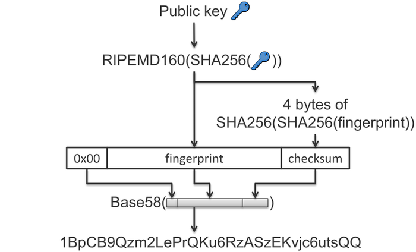

# Discover Blockchain #1 : Création d'une adresse bitcoin

L'objectif de cette suite d'article est de mieux comprendre les aspects techniques de la blockchain en s'appuyant sur
les 2 blockchains majeures : Bitcoin et Ethereum. Dans cette première partie, voyons comment créer une adresse valide et
utilisable sur la blockchain Bitcoin.

Les sources du projet sont disponibles sur GitHub : https://github.com/adrien-chinour/discover-blockchain 

## Introduction

L'adresse est l'équivalent du RIB. Il permet de définir le compte rattaché à la transaction. Il nous suffit de fournir
celle-ci à quelqu'un pour qu'il puisse nous faire un virement.

> Transfer/receive transactions of Bitcoins (Cryptocurrency, BTC) can be performed via address like the work with e-mail
> messages. (https://bitcoinwiki.org/wiki/address#Purpose_and_opportunities)

Il y a différents types d'adresses, comme présenté dans cet article : [Bitcoin address types compared: P2PKH, P2SH, P2WPKH, and more](https://unchained.com/blog/bitcoin-address-types-compared/).

Il y a 2 types d'adresses : **P2PKH** (_Pay-To-Public-Key-Hash_) et **P2SH** (_Pay-To-Script-Hash_) qui ont tous les deux évolués avec aujourd'hui les types **P2WPKH** (_Pay-to-Witness-Public-Key-Hash_) et **P2WSH** (_Pay-to-Witness-Script-Hash_).

Voyons d'abord le format, encore aujourd'hui, le plus commun : P2PKH ; même s'il tend à être remplacé par son évolution P2WPKH.

## Génération d'une adresse P2PKH

Pour ça, je vais me baser sur la documentation présente sur le site : https://developer.bitcoin.org

On peut y lire qu'une adresse utilise ECDSA comme algorithme de génération des clés :

> Bitcoin uses the Elliptic Curve Digital Signature Algorithm (ECDSA) with the secp256k1 curve; secp256k1 private keys
> are 256 bits of random data. https://developer.bitcoin.org/devguide/transactions.html

Dans les grandes lignes parce que l'objectif n'est pas de rentrer dans le détail de l'algorithme, on va fournir en
entrée un entier aléatoire, nommé _k_, dans l'intervalle _[1, n - 1 ]_ avec _n_ égal à _2^256_ pour _secp256k1_.

L'algorithme va ensuite nous donner les coordonnées x et y de notre point _k x G_ sur la courbe elliptique. G étant le
point initial de la courbe.
(x,y) correspond à notre clé publique. Et la complexité de cet algorithme réside dans la difficulté à obtenir k
sachant (x,y).


> Ce qu'il faut savoir et qui est très important, c'est que le seed que l'on va fournir contient le seul secret qui
> importe dans notre clé. La clé privée générée à partir de celui-ci sera toujours identique et par conséquent la clé
> publique aussi.

Passons au code, ici, on va utiliser les fonctions crypto déjà fournies en go pour calculer notre clé privée et notre clé
publique :

```go
package main

import (
	"crypto/ecdsa"
	"crypto/elliptic"
	"crypto/rand"
	"encoding/hex"
	"fmt"
)

func main() {
	// Generate a private key based on p256 ellipsis curve (secp256r1)
	privateKey, err := ecdsa.GenerateKey(elliptic.P256(), rand.Reader)
	if err != nil {
		fmt.Println("Cannot generate private key.", err)
	}

	// Display private key as hexadecimal string
	fmt.Printf("Private Key: %s\n", hex.EncodeToString(privateKey.D.Bytes()))

	// Display public key as hexadecimal string
	publicKey := append(privateKey.X.Bytes(), privateKey.Y.Bytes()...)
	fmt.Printf("Public Key: %s\n", hex.EncodeToString(publicKey))
}
```

Mais on n'a pas encore fini parce que notre clé publique ne correspond pas à une adresse Bitcoin. Pour ça il nous manque
quelques étapes :


Source : https://bitcoinwiki.org/wiki/address#Purpose_and_opportunities

> L'avantage de cette opération est de sécuriser encore plus notre clé publique en fournissant un hash de celle-ci et
> surtout d'économiser de la place dans la blockchain en réduisant le nombre de bit par
> adresse. https://privacypros.io/btc-faq/how-many-btc-addresses

Pour commencer, je rajoute la méthode utile hash qui va me permettre d'appliquer différents algorithmes de hashage.

```go
package main

import "crypto"

func hash(input []byte, hash crypto.Hash) []byte {
	hasher := hash.New()
	hasher.Write(input)

	return hasher.Sum(nil)
}
```

Puis, je rajoute la méthode permettant de convertir notre clé publique en adresse BTC :

```go
package main

import (
	"crypto"
	"crypto/ecdsa"
	"github.com/btcsuite/btcd/btcutil/base58"
)

func publicKeyToAddress(publicKey ecdsa.PublicKey) (string, error) {
	publicKeyBytes := append(publicKey.X.Bytes(), publicKey.Y.Bytes()...)

	network := byte(0x00)
	fingerprint := hash(hash(publicKeyBytes, crypto.SHA256), crypto.RIPEMD160)

	address := append([]byte{network}, fingerprint...)
	checksum := hash(hash(fingerprint, crypto.SHA256), crypto.SHA256)[:4]

	return base58.Encode(append(address, checksum...)), nil
}
```

> `network` permet d'utiliser le réseau principal (`0x00`) ou le réseau de test (`0x111`). 

